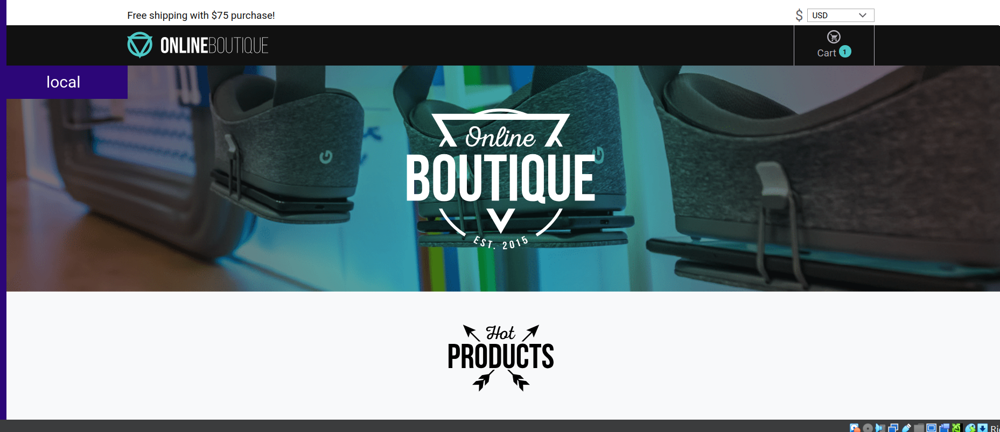
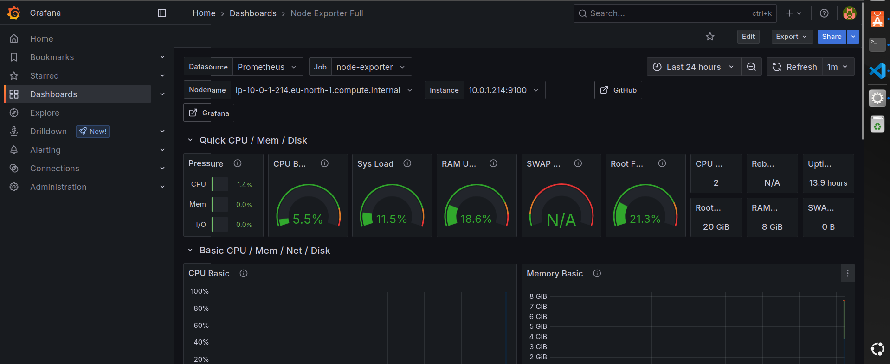
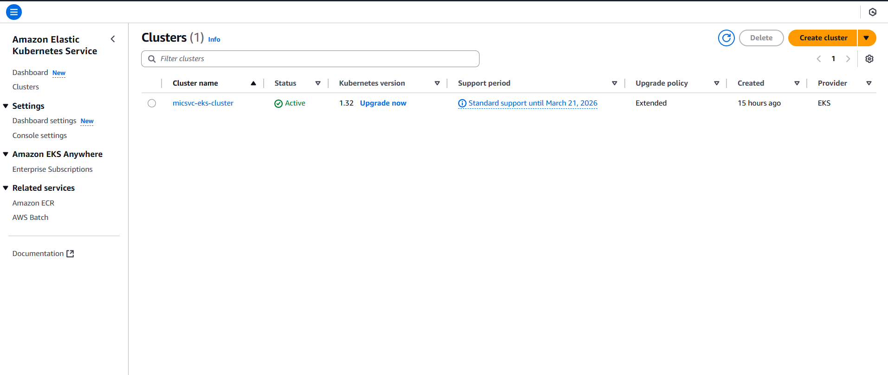

# **Automated Online Boutique (11 Microservices)**  

## **Project Overview**  
This project showcases the deployment of an **AWS EKS-based cloud infrastructure** for an **online boutique** with **11 microservices**. The entire setup is automated using **Terraform, Helm, Jenkins, and Ansible**, ensuring seamless CI/CD workflows. **Prometheus & Grafana** provide monitoring and observability, while **S3** manages Terraform state.  

### **Tech Stack:**  
- **Infrastructure & Provision:** AWS-EKS, Terraform  
- **Deployment & Orchestration:**  Helm, Kubernetes
- **Automation:** Jenkins, Ansible, Bash  
- **Monitoring:** Prometheus, Grafana  
- **Storage:** Amazon S3  

---

## **Architecture Overview**  
This setup includes separate repositories for **application code**, **infrastructure provisioning**, and **Kubernetes deployment manifests**. Below is an **architecture diagram** illustrating the overall workflow:  

  

**Workflow Overview:**  
1. **Development & CI/CD**: Jenkins automates builds, tests, and deployments.  
2. **Infrastructure Provisioning**: Terraform provisions AWS resources, and Ansible handles system configuration.  
3. **Microservices Deployment**: Kubernetes orchestrates containers using Helm charts.  
4. **Monitoring & Alerting**: Prometheus collects metrics, and Grafana visualizes system performance.  

---

## **Screenshots & Monitoring**  

### **Online Boutique UI**  
  

### **Prometheus Dashboard**  
  

### **Prometheus Query Metrics**  
  

### **Grafana Monitoring**  
  

### **Node Exporter Dashboard**  
  

### **Kubernetes Cluster**  
  

### **Alert Manager**  
  


### **AWS Infrastructure Details**  
- **EKS Management Console**  
    
- **S3 Terraform State Management**  
    

---

## **Repository Structure & Links**  

Repository Structure
📂 micsvc-manifests/ →  Helm configurations for microservices deployment & Kubernetes YAML files for services, deployments, and monitoring
📂 infra-tf-pb/ →  Contains Terraform scripts for AWS provisioning & Stores playbooks for system setup & configuration
📂 micsvc-project/ → Holds CI/CD automation pipeline configuration

- **Application Repo** (Contains Jenkinsfile):  
  🔗 [micsvc-project](https://github.com/Osamaghorab/micsvc-project)  

- **Infrastructure Repo** (Terraform & Ansible for provisioning):  
  🔗 [infra-tf-pb](https://github.com/Osamaghorab/infra-tf-pb)  

- **Deployment Repo** (Kubernetes manifests & Helm charts):  
  🔗 [micsvc-manifests](https://github.com/Osamaghorab/micsvc-manifests)  


---

## **Setup & Deployment**  
### **Prerequisites**  
- AWS CLI & configured credentials  
- Terraform & Ansible installed  
- Kubernetes CLI (`kubectl`) & Helm  

### **Deployment Steps**  
1. **Clone repositories:**  
   ```sh
   git clone git@github.com:Osamaghorab/micsvc-project.git
   git clone git@github.com:Osamaghorab/infra-tf-pb.git
   git clone git@github.com:Osamaghorab/micsvc-manifests.git


- Clone the Original Microservices Repo:
This project is built upon the Google Cloud Microservices Demo. You can clone it for reference using:
git clone https://github.com/GoogleCloudPlatform/microservices-demo.git
- Note: The original repo is referenced here as an example but is not mandatory for this project's deployment.
Contributors & Credits- Original repo: Google Cloud Microservices Demo
- Built by Osama Ghorab